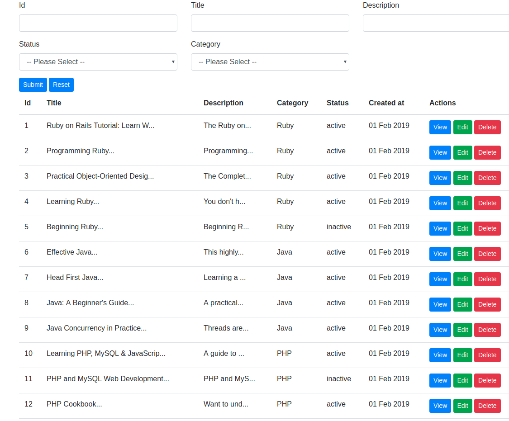
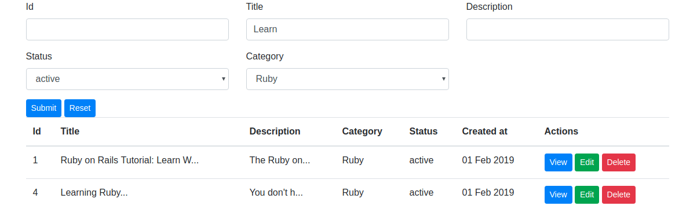

# EzDatatable

Easy and Customizable datatable for Ruby on Rails. Usually in admin panel you gonna need to list data from your 
model and have a search bar to filter the data and buttons for View, Edit, Delete model. 
So This is just another gem that help you handle those kinds of boring jobs. 

*** Currently support only MySQL.

### Usage

1 - Add to your Gemfile

```
gem 'ez_datatable'
```

2 - Install the gem

```
bundle install
```

3 - Run the install generator (This will generate view files "views/ez_datatable/_table.html.erb")

```
rails generate ez_datatable:view
```

4 - Include EzDatatable module in controller (yo)

```ruby
include EzDatatable::Controller
```

Example (You can put it one place at "ApplicationController" if you like): 

```ruby
class BooksController < ApplicationController
	include EzDatatable::Controller
end
```
 
5 - Include EzDatatable module in model

```ruby
include EzDatatable::Model
```

Example (You can put it one place at "ApplicationController" if you like): 

```ruby
class Book < ApplicationRecord
	include EzDatatable::Model
end
```

6 - **Create class method and instance method in model. see example in the link below (/test/dummy/app/models/book.rb).**

*** Please read the comments in the example model.

[Click Here to See Example](test/dummy/app/models/book.rb)

7 - Setup action in controller (You can use with will_paginate)

7.1 - You must pass params[:filter] and params[:operator] to "search" method

```ruby
@books = Book.search(params[:filter], params[:operator]).paginate(per_page: 10, page: params[:page])
```

7.2 - You must pass collections and datatable configuration to "_table" method

```ruby
@table = _table(@books, Book.datatable_config)
```

Example:

```ruby
def index
	@books = Book.search(params[:filter], params[:operator]).paginate(per_page: 10, page: params[:page])
	@table = _table(@books, Book.datatable_config)
end
```

8. Display Datatable in view (example: in index.html.erb)

```ruby
<%= @table %>
```

### Screenshots

##### Table



##### After Search



### Todos

- support PostgreSQL 

### Notes

I normally use this datatable in every projects but as a services class. So everytime i start a new project have to copy and paste those related files to new projects. 
Now i decide to build it as a gem so me and my colleagues can use this a lot easier :)